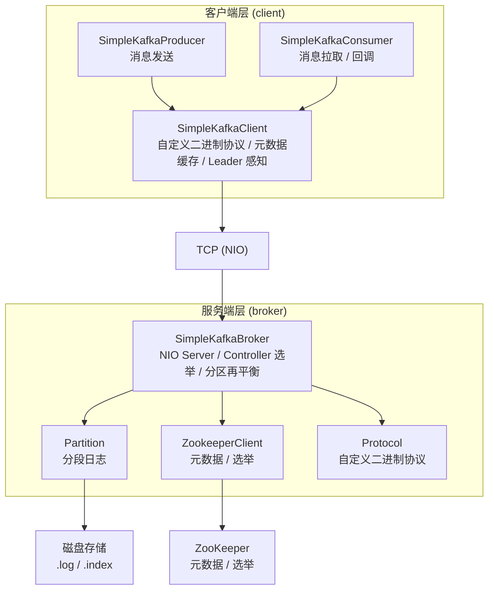

# SimpleKafka

一个用于**分布式系统教学**的简化版 Kafka 实现，从零构造消息队列核心机制。

## 项目定位

本项目不是生产级的消息中间件，而是通过**可运行的代码**展示 Kafka 的核心设计思想。每个类都配有详尽的中文注释，解释"为什么这样设计"和"在真实 Kafka 中对应什么概念"，适合学习分布式系统、消息队列原理的开发者。

## 快速开始

### 前置依赖

- JDK 21+
- Apache ZooKeeper 3.8.x（本地运行，默认端口 2181）
- Maven 3.x

### 编译打包

```bash
mvn clean package -DskipTests
```

打包产物为 `target/SimpleKafka-1.0-SNAPSHOT.jar`，入口类为 `SimpleKafkaBroker`。

### 启动 Broker 节点

```bash
# 启动 Broker 0，监听 9092 端口
java -cp target/SimpleKafka-1.0-SNAPSHOT.jar com.loong.kafka.broker.SimpleKafkaBroker 0 127.0.0.1 9092

# 启动 Broker 1，监听 9093 端口（多节点集群）
java -cp target/SimpleKafka-1.0-SNAPSHOT.jar com.loong.kafka.broker.SimpleKafkaBroker 1 127.0.0.1 9093
```

### 运行生产者

```bash
java -cp target/SimpleKafka-1.0-SNAPSHOT.jar com.loong.kafka.client.SimpleKafkaProducer 127.0.0.1 9092 my-topic
```

### 运行消费者

```bash
java -cp target/SimpleKafka-1.0-SNAPSHOT.jar com.loong.kafka.client.SimpleKafkaConsumer 127.0.0.1 9092 my-topic 0
```

## 架构概览



## 模块说明

### broker — 服务端核心

| 类                      | 职责                                                                                    | 对应真实 Kafka         |
| ----------------------- | --------------------------------------------------------------------------------------- | ---------------------- |
| `SimpleKafkaBroker`     | 消息代理主程序：接受 TCP 连接、处理读写、集群协作                                       | Kafka Broker           |
| `Partition`             | 分区存储引擎：分段日志(.log) + 稀疏索引(.index)，支持追加写和按 offset 读取             | LogSegment             |
| `Protocol`              | 自定义二进制通信协议：定义了 PRODUCE、FETCH、METADATA 等 10 种消息类型及编解码          | Kafka Protocol         |
| `ZookeeperClient`       | ZooKeeper 客户端封装：临时节点注册、持久节点元数据、Watch 机制                          | Kafka ZooKeeper 集成   |

### client — 客户端 SDK

| 类                      | 职责                                                                 | 对应真实 Kafka   |
| ----------------------- | -------------------------------------------------------------------- | ---------------- |
| `SimpleKafkaClient`     | 底层通信：元数据拉取、Leader 感知路由、请求/响应编解码               | NetworkClient    |
| `SimpleKafkaProducer`   | 生产者：自动创建 Topic、随机/指定分区发送                            | KafkaProducer    |
| `SimpleKafkaConsumer`   | 消费者：Offset 自动推进、手动 poll 与自动回调两种模式                | KafkaConsumer    |

## 已实现的核心特性

### 消息存储

- **分段日志（Segment）**：单文件超过 1MB 自动滚动，避免单文件过大
- **稀疏索引**：每条索引记录 16 字节（8B offset + 8B position），二分查找快速定位
- **强制刷盘**：每条消息写入后 `force(true)` 保证持久性
- **读写锁**：`ReentrantReadWriteLock` — 多消费者并发读，写入排他

### 集群协作

- **Controller 选举**：基于 ZooKeeper 临时节点实现分布式互斥锁，先创建者成为 Controller
- **动态感知**：Watch `/brokers` 子节点变化，Broker 加入/离开实时检测
- **分区再平衡**：Controller 在集群成员变化时自动重新分配 Leader/Follower
- **Topic 创建通知**：Controller 创建 Topic 后通过 TCP 直接通知所有 Broker 加载

### 副本机制

- **Leader 写入**：只有 Leader 接受生产者写入
- **Follower 复制**：Leader 异步将消息复制到所有 Follower
- **自动转发**：生产者误连 Follower 时，自动转发请求到 Leader
- **故障切换**：Leader 下线后 Controller 重新分配新 Leader

### 客户端

- **元数据驱动**：自动发现集群拓扑（Broker 列表、分区 Leader 位置）
- **分区路由**：随机分区（负载均衡）或指定分区（保证顺序）
- **Offset 管理**：自动推进消费位置，支持 `seek()` 跳转

## 项目结构

| 路径 | 说明 |
| --- | --- |
| `docs/` | 文档（预留） |
| `src/main/java/com/loong/kafka/broker/SimpleKafkaBroker.java` | Broker 主程序 |
| `src/main/java/com/loong/kafka/broker/Partition.java` | 分区存储引擎 |
| `src/main/java/com/loong/kafka/broker/Protocol.java` | 通信协议定义 |
| `src/main/java/com/loong/kafka/broker/ZookeeperClient.java` | ZooKeeper 客户端 |
| `src/main/java/com/loong/kafka/client/SimpleKafkaClient.java` | 底层客户端 |
| `src/main/java/com/loong/kafka/client/SimpleKafkaProducer.java` | 生产者封装 |
| `src/main/java/com/loong/kafka/client/SimpleKafkaConsumer.java` | 消费者封装 |
| `data/` | 消息数据目录（自动创建） |
| `pom.xml` | Maven 配置 |
| `.gitignore` | Git 忽略规则 |

## 通信协议

协议采用简洁的二进制格式，每种请求/响应第一个字节标识类型：

| 类型                      | 值     | 方向                | 说明                     |
| ------------------------- | ------ | ------------------- | ------------------------ |
| `PRODUCE`                 | 0x01   | Client → Broker     | 发送消息                 |
| `FETCH`                   | 0x02   | Client → Broker     | 拉取消息                 |
| `METADATA`                | 0x03   | Client → Broker     | 查询集群元数据           |
| `CREATE_TOPIC`            | 0x04   | Client → Broker     | 创建主题                 |
| `PRODUCE_RESPONSE`        | 0x11   | Broker → Client     | 生产响应                 |
| `FETCH_RESPONSE`          | 0x12   | Broker → Client     | 消费响应                 |
| `METADATA_RESPONSE`       | 0x13   | Broker → Client     | 元数据响应               |
| `CREATE_TOPIC_RESPONSE`   | 0x14   | Broker → Client     | 创建主题响应             |
| `ERROR_RESPONSE`          | 0x1F   | Broker → Client     | 通用错误响应             |
| `REPLICATE`               | 0x21   | Broker → Broker     | Leader 复制到 Follower   |
| `REPLICATE_ACK`           | 0x22   | Broker → Broker     | 复制确认                 |
| `TOPIC_NOTIFICATION`      | 0x23   | Broker → Broker     | Topic 创建通知           |

### 请求示例

**发送消息 (PRODUCE)**

| 字段 | 长度 | 说明 |
| --- | --- | --- |
| `0x01` | 1B | 请求类型 |
| topic长度 | 2B | Topic 名称字节长度 |
| topic名 | NB | Topic 名称内容 |
| 分区ID | 4B | 目标分区编号 |
| 消息长度 | 4B | 消息内容字节长度 |
| 消息内容 | NB | 实际消息数据 |

**拉取消息 (FETCH)**

| 字段 | 长度 | 说明 |
| --- | --- | --- |
| `0x02` | 1B | 请求类型 |
| topic长度 | 2B | Topic 名称字节长度 |
| topic名 | NB | Topic 名称内容 |
| 分区ID | 4B | 目标分区编号 |
| offset | 8B | 起始消费偏移量 |
| maxBytes | 4B | 本次最多拉取字节数 |

## 数据存储格式

### .log 文件（消息数据）

| 字段 | 长度 | 说明 |
| --- | --- | --- |
| 消息长度 | 4B | 消息内容字节长度 |
| 消息内容 | NB | 实际消息数据 |

### .index 文件（稀疏索引）

| 字段 | 长度 | 说明 |
| --- | --- | --- |
| offset | 8B | 消息偏移量 |
| 文件物理位置 | 8B | 消息在 `.log` 文件中的起始位置 |

分段文件命名规则：`{20位offset}.log` / `{20位offset}.index`（如 `00000000000000000000.log`）

## 设计取舍与简化

为保持代码清晰可读，本项目做了以下简化：

- **NIO 而非零拷贝**：使用 Java NIO SocketChannel，未实现 `sendfile` 零拷贝
- **单线程网络模型**：未实现 Reactor 多线程模型
- **简单消费者组**：未实现 Consumer Group 和 Rebalance 协议
- **无 ISR 机制**：副本复制采用"尽力而为"策略，无 In-Sync Replica 跟踪
- **无日志清理**：未实现 compaction 和 retention 策略
- **无认证授权**：未实现 SASL/SSL 安全层

## License

本项目仅用于教学目的。
